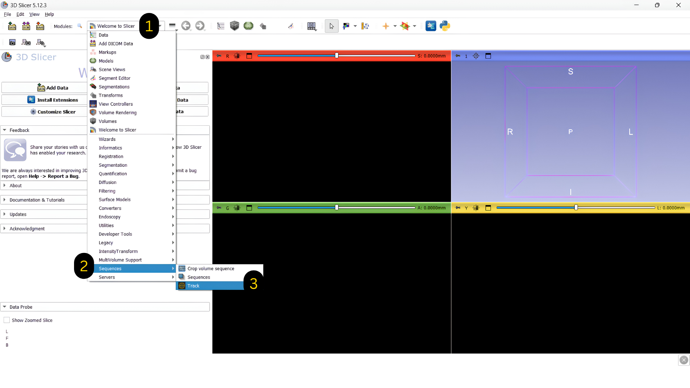
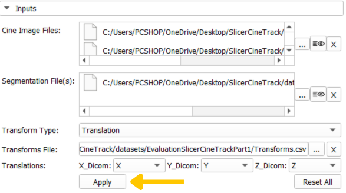
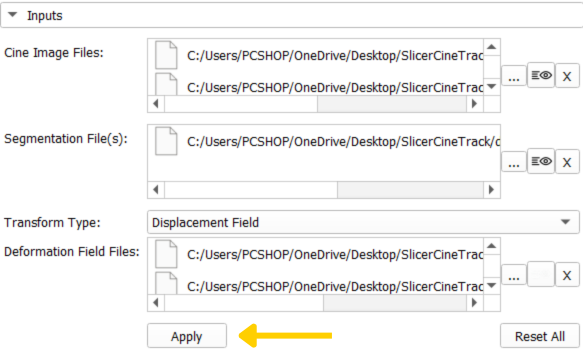
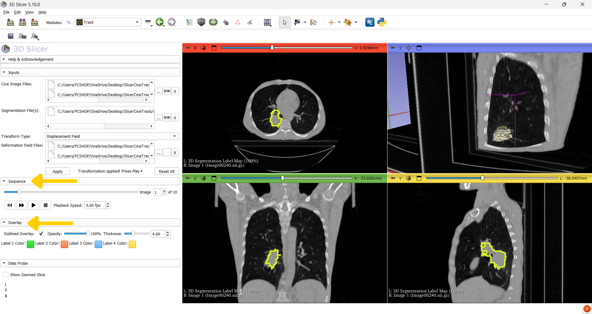

Documentation

# Getting started

A beginner-friendly walkthrough for installing SlicerCineTrack and running your first verification.

## 1. Install the extension

1

Open 3D Slicer, then go to View &rarr; Extensions Manager (or the puzzle-piece icon in the toolbar).

2

Search for "SlicerCineTrack" and click Install.

3

Restart 3D Slicer when prompted to load the new module.

4

Now open 3D Slicer and navigate to SlicerCineTrack by selecting the (1) dropdown menu > (2) Sequences > (3) Track.

## 2. Prepare your three inputs

SlicerCineTrack accepts three inputs for every verification run (In this version it is optional to provide <strong>Segmentation file</strong> and <strong>Transform file</strong> and you can just have the cine images play!):

  

    <h3>Cine images</h3>
    
A time-series of medical images. Supported formats: <code>.mha .dcm .nrrd .nii .hdr .nhdr .mhd</code>

  

  

    <h3>Segmentation</h3>
    
The target to track, e.g. a tumor outline as a segmentation node.

  

Choose your desired workflow using the <strong>Transform Type</strong> dropdown:

  

    <h3>Translation</h3>
    
You will need a .csv or Excel file with the X, Y, Z movement per frame.

    
Use this when your target moves but keeps its shape, like an organ shifting as the patient breathes. You provide how far it moved at each frame, and SlicerCineTrack slides the outline to follow it.

    
Choose the <strong>X_Dicom</strong>, <strong>Y_Dicom</strong>, and <strong>Z_Dicom</strong> headers for the X/Y/Z-direction transformations, then click <strong>Apply</strong>.

    

  

  

    <h3>Displacement Field</h3>
    
You will need one .h5 / .hdf5 file per frame.

    
Use this when your target changes shape as it moves, stretching or bending, not just shifting. Instead of a single movement, you provide a field describing how every point warps.

    
Add your <strong>Deformation Field Files</strong>, then click <strong>Apply</strong>.

    

  

## 3. Play back and inspect

Once your inputs are loaded, SlicerCineTrack auto-detects each image's orientation and maps it to the correct view (sagittal, coronal, or axial).

&#9654;

<strong>Playback &amp; frame rate</strong> : step frame-by-frame or auto-play, with an adjustable FPS (00.00&ndash;30.00) to slow down around a suspected error.

&#9680;

<strong>Overlay styling</strong> : draw the segmentation as outline or filled, and set its color, thickness, and opacity.

&#9670;

<strong>Automatic orientation detection</strong> : images are mapped into the correct anatomical view without manual setup.

## Additional features

- Play cine images zoomed in/out
- Adjust overlay opacity using the overlay opacity slider bar
- Use the image slider bar to move to a specific frame
- Insert frame number into the frame box to move to that specific frame
- Adjust the frames per second from 00.00 - 30.00 fps
- Click the X buttons to delete a specific input
- Click the Reset All button to remove all inputs

## Sample dataset

This dataset was created based on a dataset sourced from the Cancer Imaging Archive (TCIA), and more specifically:

Hugo, G. D., Weiss, E., Sleeman, W. C., Balik, S., Keall, P. J., Lu, J., & Williamson, J. F. (2016). Data from 4D Lung Imaging of NSCLC Patients (Version 2) [Data set]. The Cancer Imaging Archive. https://doi.org/10.7937/K9/TCIA.2016.ELN8YGLE

Before accessing or utilizing this data, please refer to and adhere to the TCIA data use policy.

**Sample Data set can be downloaded from** [here](https://www.cancerimagingarchive.net/collection/4d-lung/)
